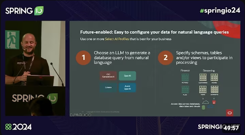

# OCI DB Select AI

> This content is a Work In Progress

This project show you how to work with [Oracle Database Select AI](https://www.oracle.com/es/autonomous-database/select-ai/).

> ### The Main Use-Case
>
> - People that needs to consume the data don't necessarily know coding in SQL or the database structure.
> - The people that knows SQL and the schema don't want to make changes every second day to adapt for the needs of the first group of people.
> - Select AI bridges the gap making everybody happy.
> - It benefits any industry and can be deployed virtually in any case regardless of your Oracle Database deployment choice.

You will have a fully functional deployment to battle-tested your knowledge with hands-on experience, and make adjustments on the code to fit your needs.

Happy hacking!

## Introduction

Oracle Database Select AI is a functionality that translate natural language prompts into SQL queries based on the database schema. You can say to Select AI `what is the total number of customers?` and you will get, behind the scenes, the `SELECT count(*) FROM CUSTOMERS;`. Select AI is included in Oracle Database since the version 19c.

You can watch the recording of my presentation at [Spring.io](https://spring.io/) 2024 Conference in Barcelona by clicking the image bellow.

[](https://youtu.be/4k96Eca02xQ?si=WH7dBX3Fkz0vJqWT)

In this project you deploy an [Autonomous Database](https://www.oracle.com/in/autonomous-database/) shared 23ai, although the plan is to have two Autonomous databases, one that can simulate any on-prem/cloud@customer/Exa infrastructure production workload and a separate Autonomous for running Select AI with only the metadata from the production schema. Select AI only needs that metadata to generate accurate SQL code. The SQL generated code can then be run on the production database to get the results.

Currently, Select AI supports [OCI Generative AI](https://www.oracle.com/in/artificial-intelligence/generative-ai/generative-ai-service/) hosting "chat" models, as well as main generative AI providers like OpenAI or Cohere. You will take the approach of OCI Generative AI and in the future we will support the scenario where even the model is running on-prem or within your own custom model deployment. To make calls to this hosted models, you need to have credentials for calling the services or in the case of OCI Generative AI either a user with API KEY or Resource Principal with policies to allow communication between Autonomous and OCI Generative AI.

The stack of technology is automatically deployed using [Google ZX](https://google.github.io/zx/) scripts to set the environment, [Terraform](https://registry.terraform.io/providers/oracle/oci/latest/docs) to create cloud resources and [Ansible](https://docs.ansible.com/) to provision backend, operator compute than then interact with Autonomous to run SQL code to set up credentials, profiles, and other prerequisite. The instructions are in this README.

Select AI requires credentials for the different target LLMs models, and a profile that points to the credentials, the schema to work on as well as some metadata like model name, region, etc.

There is a JAVA backend (in development) and a website (in development) to have a high level abstract of the use case to make it easy to demo to non-technical people.

## Documentation

- [Select AI Use Cases](https://docs.public.content.oci.oraclecloud.com/en-us/iaas/autonomous-database-serverless/doc/select-ai-use-cases.html)
- [Use Select AI for Natural Language Interaction with your Database](https://docs.oracle.com/en/cloud/paas/autonomous-database/serverless/adbsb/sql-generation-ai-autonomous.html)
- [Examples of Using Select AI](https://docs.oracle.com/en-us/iaas/autonomous-database-serverless/doc/select-ai-examples.html)
- [DBMS_CLOUD_AI Package](https://docs.oracle.com/en-us/iaas/autonomous-database-serverless/doc/dbms-cloud-ai-package.html)
- [DBMS_CLOUD_AI Package - Profile Attributes](https://docs.oracle.com/en/cloud/paas/autonomous-database/serverless/adbsb/dbms-cloud-ai-package.html#GUID-12D91681-B51C-48E0-93FD-9ABC67B0F375)
- [Getting Access to Generative AI](https://docs.oracle.com/en-us/iaas/Content/generative-ai/iam-policies.htm)
- [Enable Resource Principal to Access OCI Resources](https://docs.oracle.com/en-us/iaas/autonomous-database-serverless/doc/resource-principal.html)

## Requirements

- Node.js (LTS version preferred, tested on v22.13)
- OpenSSL installed
- Java JDK (23 preferred, tested on 23.0.1; 17+ will work with minor changes)
- OCI CLI (installed and configured)
- Oracle Cloud account (region that support OCI Gen AI)
- Admin permissions on OCI

## Clone the repository

```bash
git clone https://github.com/vmleon/oci-db-select-ai.git
```

Go to the newly cloned folder `oci-db-select-ai`.

```bash
cd oci-db-select-ai
```

## Setup environment

Install the dependencies for the scripts in [Google ZX](https://google.github.io/zx/).

```bash
cd scripts/ && npm install && cd ..
```

## Build components

Build Backend

```bash
cd src/backend
```

```bash
./gradlew clean bootJar
```

```bash
cd ../..
```

## Setup environment

Answer all the questions from `setenv.mjs` script:

```bash
zx scripts/setenv.mjs
```

## Deploy with Terraform

Generate the `terraform.tfvars` file:

```bash
zx scripts/tfvars.mjs
```

Run the commands that `tfvars.mjs` output in yellow one by one.

> Alternative: One liner for the yellow commands (for easy copy paste)
>
> ```bash
> cd deploy/tf/app && terraform init && terraform apply -auto-approve
> ```

This process will take a few minutes.

After the resource creation is done, come back to the root folder:

```bash
cd ../../..
```

## SSH into the machines

Create the bastion host session

```bash
zx scripts/bastion-session.mjs
```

Paste the yellow command to connect with SSH into the compute instance.

To connect, answer `yes` to add the fingerprint to the know hosts.

> Connecting to the Backend machine:
>
> When in the `ops` machine, you can also connect to the `backend` machine with this command
>
> ```bash
> ssh -i /home/opc/private.key opc@$(jq -r .backend_private_ip ansible_params.json)
> ```

## Run Select AI queries

Run a normal query against the `SH` schema containing Sales information.

```bash
sql -name admin -s @/home/opc/queries/sh_example_query.sql
```

Run a natural query language to count the number of customers, the result will be SQL code that can be executed.

```bash
sql -name admin -s @/home/opc/queries/nql_count_customers_resource_principal.sql
```

> Execute the result as admin:
>
> ```bash
> sql -name admin -s
> ```
>
> From SQLcl console, run the query you got above. For example:
>
> ```sql
> SELECT COUNT("c"."CUST_ID") AS "Total_Customers" FROM "SH"."CUSTOMERS" "c"
> ```
>
> To exit, type:
>
> ```sql
> exit;
> ```
>
> Run another natural query language to list the top 10 customers that buying hardware, the result will be SQL code that can be executed.

```bash
sql -name admin -s @/home/opc/queries/nql_customers_buying_hardware_resource_principal.sql
```

## Clean up

Go to the folder `deploy/tf/app`.

```bash
cd deploy/tf/app
```

Run the Terraform destroy:

```bash
terraform destroy -auto-approve
```

Come back to the root compartment:

```bash
cd ../../..
```

Clean all auxiliary files:

```bash
zx scripts/clean.mjs
```
